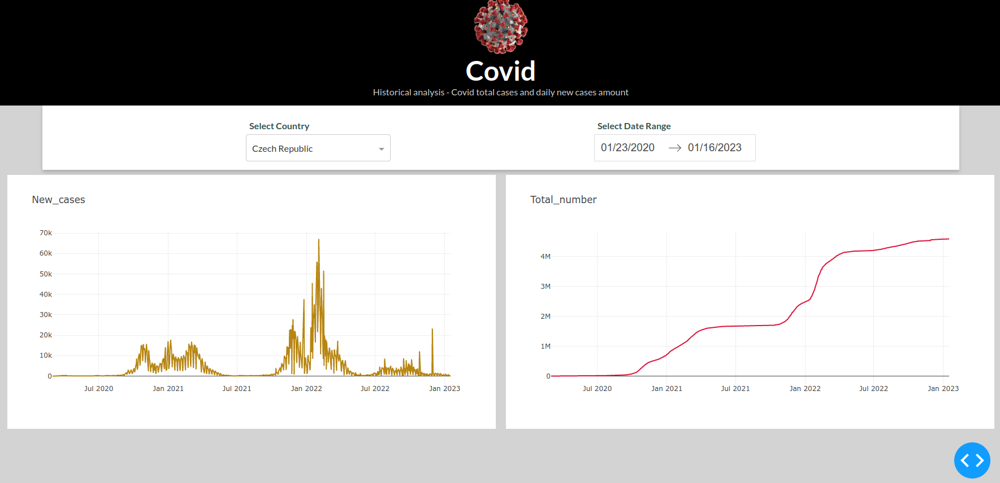

## Covid Dashboard 

> Create analytical applications

- Dash - Covid historical analysis
- Framework for analytical applications - based on HTML and CSS
- Online covid database from Github: "https://raw.githubusercontent.com/CSSEGISandData/COVID-19/master/csse_covid_19_data/csse_covid_19_time_series/time_series_covid19_confirmed_global.csv"

**Required libraries**: *dash, dash_core_components, dash_html_components, numpy ,pandas*

